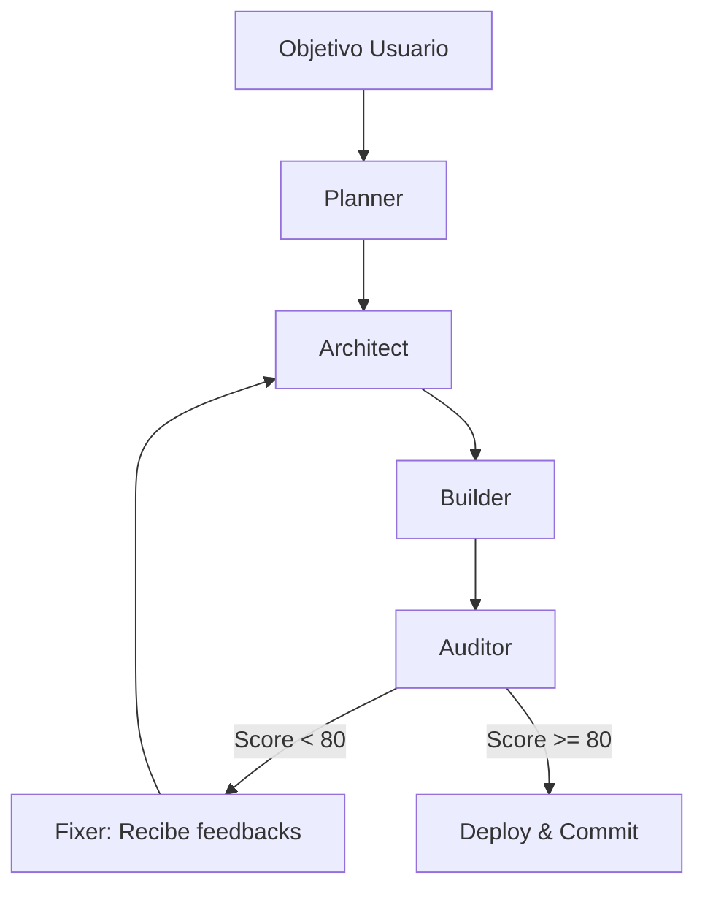

# 🧠 🏗️ GMM AUTO-BUILDER SYSTEM v1.0

Este sistema representa la evolución final de la arquitectura GMM: **IA que construye IA**. El Auto-Builder no solo genera JSON de n8n, sino que aplica una "capa de blindaje" automática basada en los estándares de auditoría definidos.

---

## 🧩 1. PIPELINE DE CONSTRUCCIÓN

El proceso sigue un flujo lineal con retroalimentación (Self-Healing Loop):

1.  **Planner (Cerebro)**: Entiende el objetivo del usuario y desglosa los requisitos de datos.
2.  **Architect (Diseñador)**: Define la secuencia de nodos, tipos de conexión y puertos.
3.  **Builder (Constructor)**: Genera el JSON raw de n8n aplicando el **DNA de Hardening** (retries, timeouts, logging).
4.  **Auditor (Control de Calidad)**: Evalúa el JSON generado contra las reglas de seguridad y resiliencia.
5.  **Fixer (Auto-reparación)**: Si el score es < 80, analiza los errores y solicita una regeneración al Architect.

---

## 🛡️ 2. ESTÁNDARES DE "HARDENING" (DNA GMM)

Todo workflow generado por el Auto-Builder debe cumplir estos "Checkpoints de ADN":

| Característica | Regla de Oro | Razón Técnica |
| :--- | :--- | :--- |
| **Validation** | Todos los inputs deben validarse en el primer `IF`. | Evita errores de "undefined" en cascada. |
| **Retries** | Todos los nodos HTTP deben tener `maxTries: 3`. | Resiliencia ante fallas intermitentes de red. |
| **Logging** | Cada paso crítico debe insertar en `system_logs`. | Observabilidad absoluta del flujo. |
| **Error Gate** | Los errores deben capturarse con el `Error Trigger` global. | Previene workflows "colgados" o fantasma. |
| **Normalization** | Uso obligatorio de optional chaining (`?.`) en JavaScript. | Código a prueba de bombas contra nulos. |

---

## 🔁 3. EL BUCLE DE AUTO-REPARACIÓN (SELF-HEALING)

---

## 📊 4. MÉTRICAS DE RESILIENCIA

El Auto-Builder genera un reporte técnico por cada construcción:

*   **Complexity Score**: Densidad de nodos vs lógica.
*   **Resilience Index**: Porcentaje de nodos con manejo de errores activo.
*   **Observability Coverage**: Ratio de logs insertados por cada 100ms de ejecución.

---

## 🧠 🚀 PRÓXIMOS PASOS

1.  **Integración con Dashboard**: Crear el botón `[GENERAR]` en la UI.
2.  **Librería de Patrones**: Alimentar al Architect con los workflows exitosos de `GMM Processing`.
3.  **Predicción de Errores**: Implementar análisis estático para detectar "Race Conditions" en n8n.

---

> [!IMPORTANT]
> **GASOLINA IA**: Este sistema consume tokens de alta calidad (GPT-4o / Claude 3.5). Asegúrate de que el Planner optimice el contexto para no agotar la cuota en bucles de reparación infinitos.

---
*Documentación generada por Antigravity v3.0 — 2026*
