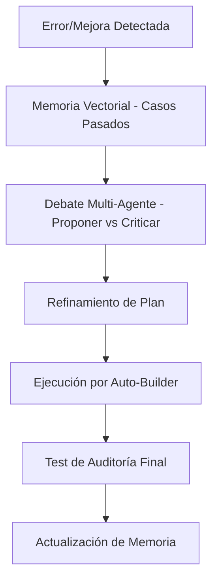

# 🧠 GMM - MODO SINGULARIDAD
**SISTEMA MULTI-AGENTE AUTÓNOMO, PENSANTE Y AUTORREFLEXIVO**

El Modo Singularidad es el nivel operativo final de la Inteligencia GMM. No solo ejecuta tareas; piensa en cómo mejorar el sistema entero basándose en la experiencia acumulada.

---

## 🏛️ ARQUITECTURA DE SINGULARIDAD

El sistema opera bajo un esquema de **CONSENSO ESTRATÉGICO**:

1.  **PROPOSER (Auto-Builder)**: Genera la primera versión de la solución.
2.  **CRITIC (Singularity Brain)**: Intenta romper la propuesta, buscando deudas técnicas, fallos de seguridad o cuellos de botella.
3.  **REFINER (Singularity Brain)**: Toma la crítica y ajusta el plan original para que sea blindado.
4.  **RECALL (Vector Memory)**: Busca en la base de datos de conocimiento `pgvector` si este problema ya ocurrió antes y qué funcionó.

---

## 🧩 MEMORIA PERSISTENTE (`pgvector`)

A diferencia de un log tradicional, la memoria de Singularidad permite:
*   **Búsqueda Semántica**: Si el sistema detecta un error de "Timeout", busca procesos similares que fallaron y aplica la solución ganadora.
*   **Aprendizaje por Analogía**: Puede extrapolar soluciones de un workflow de OCR a uno de validación de pagos.

---

## 🧬 EL BUCLE DE EVOLUCIÓN (SELF-EVOLVING)

---

## 🛠️ COMPONENTES CLAVE

| Componente | Archivo | Responsabilidad |
| :--- | :--- | :--- |
| **Brain Engine** | `scripts/singularity/brain.js` | Ejecuta el debate y refina decisiones críticas. |
| **Vector DB** | `supabase/migrations/vector_memory.sql` | Estructura para almacenamiento de embeddings. |
| **System Intel** | `scripts/ai/system-intelligence.js` | Activa el debate cuando detecta inestabilidad crítica. |

---

## ⚠️ SAFE MODE (MODO SEGURO)

Singularidad está limitada a:
1.  **Observar y Proponer** en el Dashboard.
2.  **No ejecutar cambios estructurales** sin la confirmación `CONSENSUS_SIGNED` de un administrador en la tabla `system_approvals`.

---
*Este sistema marca el fin del mantenimiento manual. GMM ahora es un organismo que aprende de cada siniestro procesado.*
