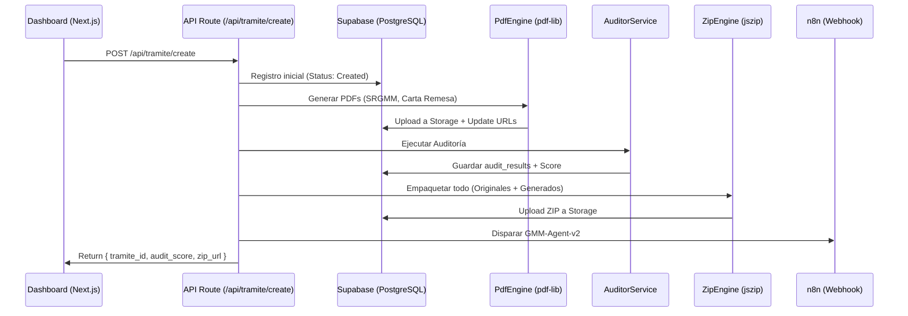

# 🏗️ ARQUITECTURA TÉCNICA: GMM AUTÓNOMO
## Flujo de Datos y Orquestación de Agentes

El sistema opera bajo un modelo de **Pipeline Lineal con Retroalimentación (Self-Healing)**. Cada etapa es atómica y reporta su estado a Supabase mediante un `trace_id`.

---

## 🔄 1. FLUJO PRINCIPAL (THE HAPPY PATH)



---

## 🧠 2. AGENTES Y RESPONSABILIDADES

### 🧬 `PdfEngine` (Logic)
*   **Input**: JSON de `claims_data`.
*   **Proceso**: Mapeo de campos técnicos a campos de formulario PDF (`pdf-lib`).
*   **Seguridad**: Flattening obligatorio para evitar ediciones externas.

### 🕵️ `AuditorService` (Business Rules)
*   **Reglas**:
    *   `valid_clabe`: 18 dígitos exactos.
    *   `valid_invoice`: Presencia de folio y montos mayores a 0.
    *   `doc_completeness`: Presencia de INE, Facturas y Firmas.
*   **Output**: JSON estructurado en la tabla `audit_results`.

### 🤖 `AiFixService` (Resolution)
*   **Modo Automático**: Corrige errores de formato y cálculos.
*   **Modo Manual**: Genera "Action Items" para el usuario en el Dashboard.

---

## 📡 3. INTEGRACIÓN CON n8n (v2)
El webhook de n8n ahora recibe un objeto enriquecido:
```json
{
  "tramite_id": "...",
  "audit_score": 95,
  "zip_url": "https://...",
  "trace_id": "GMM-PROD-...",
  "metadata": {
    "is_auto_fixed": true,
    "issues_pending": 0
  }
}
```
Esto permite que n8n decida si enviar el email inmediatamente o moverlo a una cola de "Revisión Manual".

---

## 🛠️ 4. STACK TECNOLÓGICO
*   **Runtime**: Node.js 20+ (Next.js 15).
*   **PDF Logic**: `pdf-lib`.
*   **Storage**: Supabase Storage (Bucket: `claims-docs`).
*   **Database**: Supabase (PostgreSQL) con esquemas de Observabilidad.
*   **Orquestación**: n8n Agentic Workflow.
