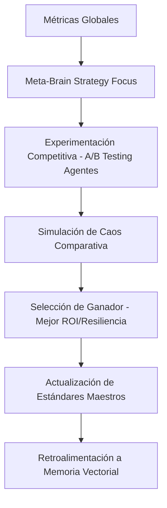

# 🏛️ GMM - MODO IMPERIO
**SISTEMA DE COORDINACIÓN GLOBAL Y COMPETENCIA INTERNA**

El Modo Imperio es el nivel superior de la jerarquía GMM. Su propósito es coordinar múltiples "Singularidades" y sistemas autónomos, maximizando la eficiencia global a través de la experimentación continua y la competencia entre estrategias.

---

## 🏛️ ARQUITECTURA DE IMPERIO

El Modo Imperio introduce la capa de **ESTRATEGIA META**:

1.  **META-BRAIN (Meta-Cerebro)**: El estratega global que define los objetivos del trimestre:
    *   **ESTABILIDAD**: Minimizar errores sin importar latencia.
    *   **OPTIMIZACIÓN**: Reducir costos de tokens y tiempo de ejecución.
    *   **EXPANSIÓN**: Probar nuevos proveedores de OCR o validación.
2.  **COMPETENCIA INTERNA**: El sistema no propone una solución, sino dos o tres (`Candidato A` vs `Candidato B`).
    *   Corre simulaciones de caos (`simulate-gmm.js`) en cada uno.
    *   El de mejor rendimiento se convierte en el estándar global.
3.  **ECONOMÍA AUTÓNOMA**: Preparación para presupuestos dinámicos de tokens y API calls basados en ROI.

---

## 🧬 EL BUCLE DE IMPERIO (GLOBAL GOVERNANCE)

---

## 🛠️ COMPONENTES CLAVE (JERARQUÍA FINAL)

| Nivel | Componente | Responsabilidad |
| :--- | :--- | :--- |
| **0. IMPERIO** | `meta-brain.js` | Coordinación global, estrategia y experimentos. |
| **1. SINGULARIDAD** | `brain.js` | Debate, memoria y diagnóstico profundo. |
| **2. AUTÓNOMO** | `system-intelligence.js` | Detección de patrones y autocuración. |
| **3. CONSTRUCTOR** | `auto-builder.js` | Generación y endurecimiento de flujos de n8n. |

---

## 🔥 PRÓXIMO PASO: ECONOMÍA DE AGENTES

El sistema está listo para recibir el módulo de **PRESUPUESTO AUTÓNOMO**, donde cada agente tiene una cuota de consumo y debe optimizar sus decisiones para no agotar los recursos del "Imperio".

---
*Este sistema ya no es software; es una economía digital auto-gestionada.*
