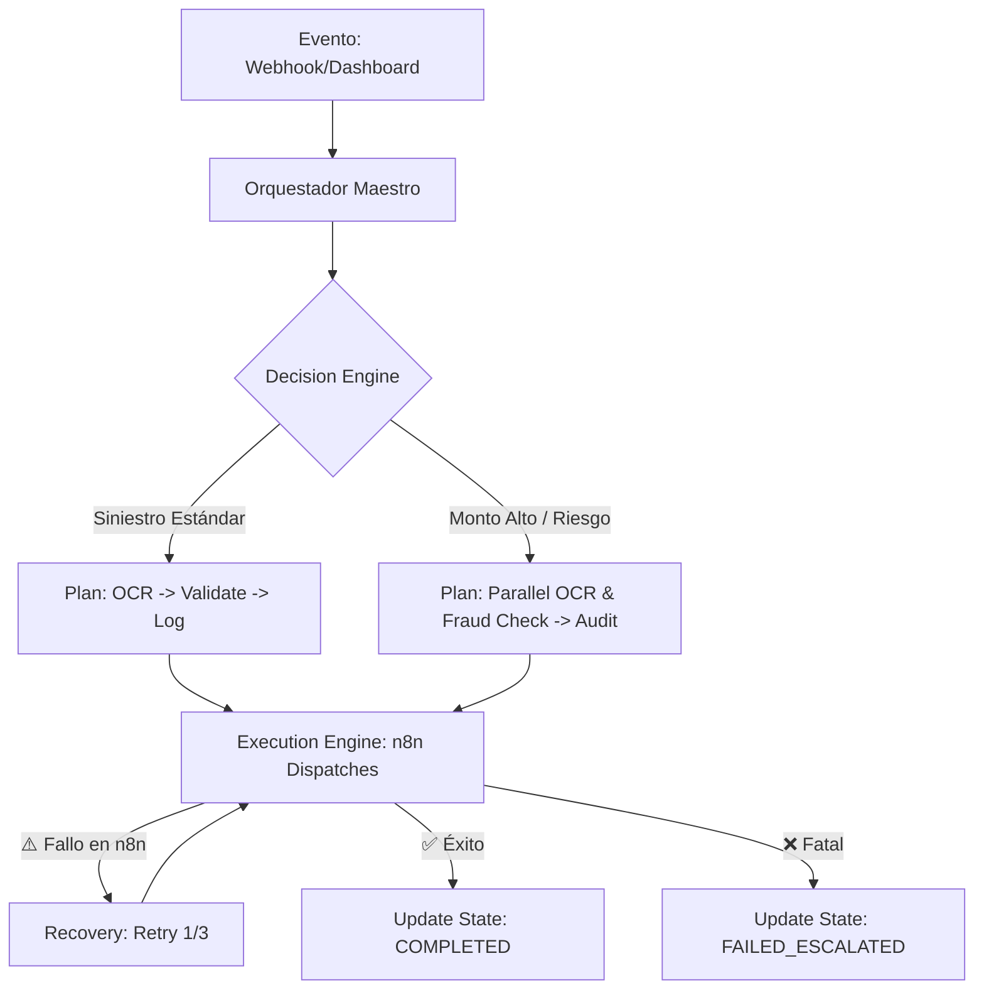

# 🧠 🏛️ MASTER ORCHESTRATOR SYSTEM v1.0

El **Orquestador Maestro** es el "Cerebro Ejecutivo" del sistema GMM. Su función es coordinar la ejecución de múltiples workflows de n8n, gestionar el estado global en tiempo real y tomar decisiones dinámicas basadas en los datos de entrada y el historial de errores.

---

## 🧩 1. RESPONSABILIDADES CLAVE

*   **State Machine (Supabase)**: Mantiene la trazabilidad del estado de cada `jobId` (`RECEIVED`, `PROCESSING`, `VALIDATING`, `COMPLETED`, `FAILED`).
*   **Decision Engine**: Decide qué ruta de ejecución tomar (ej: si el monto es > $20,000, añade un paso de auditoría senior en paralelo).
*   **Execution Engine**: Dispara los webhooks correspondientes a cada fase del proceso.
*   **Inteligent Recovery**: Implementa reintentos automáticos con backoff y escalamiento de errores críticos.

---

## ⚙️ 2. FLUJO DE ORQUESTACIÓN

---

## 📊 3. ESTADOS DEL SISTEMA (STATE MACHINE)

Los estados se sincronizan automáticamente con la tabla `public.agent_state` en Supabase:

| Estado | Descripción | Acción del Orquestador |
| :--- | :--- | :--- |
| **RECEIVED** | El job ha sido recibido por el webhook inicial. | Inicia planificación. |
| **PROCESSING_OCR** | Extracción de datos activos. | Dispara Workflow OCR. |
| **VALIDATING** | Datos normalizados pasando reglas de negocio. | Dispara Workflow Auditor. |
| **COMPLETED** | El proceso terminó con éxito total. | Cierra trace y notifica. |
| **FAILED_RETRY** | Error temporal detectado. | Reintenta con nueva ventana. |
| **FAILED_ESCALATED**| Error irreparable tras 3 intentos. | Alerta a Soporte/Dev. |

---

## 🛡️ 4. ESTRATEGIA DE RESILIENCIA

1.  **Paralelización**: Ejecuta flujos de validación y fraude simultáneamente para reducir la latencia total.
2.  **Aislamiento**: Si un sub-workflow falla, el orquestador decide si el error es bloqueante o si puede continuar con un "degrade funcional".
3.  **Trazabilidad Global**: Cada decisión y dispatch se registra en `system_logs` con un `trace_id` único, permitiendo auditorías forenses en caso de fallo.

---

## 🔮 5. EVOLUCIÓN: MODO "SISTEMA VIVO"

El orquestador está diseñado para ser **Data-Driven**:
*   Aprende qué proveedores de OCR fallan más según el tipo de hospital y cambia la ruta automáticamente.
*   Detecta cuellos de botella en n8n y ajusta la concurrencia de jobs.

---
*Documentación técnica — Sistema Autónomo GMM 2026*
